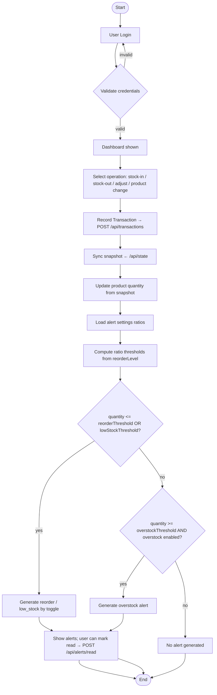

# System Documentation — Full Text Reference

Audience and purpose
This document is written for administrators and managers who must understand the complete behaviour of the Real-time Stock Manager application. It is a detailed, text-only reference intended to be copy-paste friendly into a Word document or PDF. Screenshots are intentionally left as placeholders so you can capture them from the live UI and add them to `docs/images/` later.

Executive summary
The system records and persists every stock movement as a transaction, maintains a short-term demand history for each product, computes an adaptive reorder threshold from recent demand and the configured reorder level, and generates alerts when product quantities cross computed thresholds or when unusually large stock accumulations occur. All UI pages read from the same backend snapshot so displayed data reflects the authoritative system state.

How the system works (narrative)
1) Authentication: users sign in with an email and password. The backend returns a session token and user profile containing the assigned `role` (`admin`, `manager`, or `staff`). Role determines what UI features and pages are visible and actionable.

2) Loading state: on successful login the client requests the server snapshot (products, transactions, alerts, demand, channels, static baseline) and stores it in the local app state. The app displays dashboard summaries immediately from local state and updates when snapshots are refreshed.

3) Operations: users perform inventory operations via the UI — create/edit products (if permitted), record stock-in receipts, record stock-out sales, or make inventory adjustments. Each operation results in a `Transaction` that includes product ID, quantity change, user, timestamp, and optional channel information.

4) Persist and sync: transactions are sent to `/api/transactions`. After a successful write the client refreshes the snapshot from `/api/state` or the relevant endpoints so local state is authoritative and consistent.

5) Demand and thresholds: the application maintains a series of daily `DemandPoint` values per product (a small sliding window such as 7–14 days). The alert engine computes average recent daily demand and uses it to derive an adaptive reorder threshold that is enforced alongside the product's `reorderLevel`.

6) Alerts: after state updates the alert engine evaluates each product and may generate alerts of types `low_stock`, `reorder`, or `overstock` depending on current quantity vs. thresholds. Alerts are surfaced in the Alerts page and can be marked read (which calls `/api/alerts/read`).

Key pages and what each does
Below is a full description of every primary page in the app. For each page I list the recommended screenshot filename so you can add an image later.

- Dashboard (`dashboard.jpg`): the operational overview. Displays total units in stock, estimated stock value, count of items below their reorder level, and active alert count. Includes charts showing recent demand trends and a short list of recent alerts. Use this page to quickly prioritise restocks and follow high-level performance signals.

- Inventory / Products list (`inventory.jpg`): searchable and paginated master list of products. Shows product name, SKU/code, category, supplier, current `quantity`, `reorderLevel`, and quick actions (view / edit / record stock). Use this to rapidly locate SKUs and assess inventory health across the catalog.

- Product detail / Edit (`product-detail.jpg`): full product record with fields: `id`, `name`, `category`, `supplier`, `quantity`, `reorderLevel`, `unitPrice`, `color`, `code`, and `status`. Editing updates product metadata and reorder thresholds. This page also displays recent transactions and recent demand points for that SKU.

- Stock In (`stock-in.jpg`): form for receiving inventory. Select product, enter quantity received, optional channel (supplier or receiving location), and note. Submitting records a `Transaction` of type `in` and the system syncs the snapshot.

- Stock Out (`stock-out.jpg`): form for recording sales or removals. Select product, enter quantity out, choose sales channel (retail, online, marketplace), and submit. This records a `Transaction` of type `out` and triggers snapshot refresh and alert re-evaluation.

- Alerts (`alerts.jpg`): list of active alerts generated by the alert engine. Each alert contains product name, type (`low_stock`, `reorder`, `overstock`), a human-readable message including current quantity and recent average demand, timestamp, and read/unread state. Users can mark individual alerts (or all) as read; marking read calls `/api/alerts/read` and updates the snapshot.

- Reports (`reports.jpg`): reporting hub with daily sales reports, inventory summary, and performance metrics. Use filters by date and channel. Reports read from backend data and are primarily for managers to validate operations and generate recommendations.

- Channels / Settings (`settings.jpg`): manage sales channels (enable/disable, change notes), and system level options available to admins and managers. Channel configuration affects where stock-out transactions are attributed.

- Import (`import.jpg`): CSV or structured import for adding many products quickly. Admins and managers may use this for onboarding or bulk update.

- Guide / Help (`guide.jpg`): contextual help page summarising roles, daily operations checklist, and common troubleshooting steps.

- Profile (`profile.jpg`): user profile and quick actions, with role displayed and sign-out link.

Roles and permissions
The application uses a small role matrix: `admin`, `manager`, `staff`. Each role unlocks a specific set of capabilities. High-level mapping:
- Admin: full control — create/update/delete products, manage channels, import and reset data, view all reports, view system documentation.
- Manager: operational control — create/update products, stock in/out, view reports, manage channels (but not destructive reset), view system documentation.
- Staff: frontline operations — record stock movements, view products, view alerts and dashboard; cannot create products or manage channels.

See `src/lib/inventory-store.ts` for exact capability assignments.

Data model (short reference)
- Product: { id, name, category, supplier, quantity, reorderLevel, unitPrice, color?, code?, status? }
- Transaction: { id, productId, productName, userId, userName?, quantityChanged, type: 'in'|'out'|'adjust', channelId?, timestamp }
- Alert: { id, productId, productName, type: 'low_stock'|'reorder'|'overstock', message, timestamp, read }
- DemandPoint: { productId, day, demand }

Decision logic and formulas (plain text)
The alert engine uses configurable ratios managed by admins/managers from Settings. Ratios are applied against each product's `reorderLevel`.

1) Compute thresholds from settings:

   lowStockThreshold = reorderLevel * lowStockRatio
   reorderThreshold = reorderLevel * reorderRatio
   overstockThreshold = reorderLevel * overstockRatio

2) Alert rules:
- If `enableReorder` is true and quantity <= reorderThreshold, raise `reorder`.
- Else if `enableLowStock` is true and quantity <= lowStockThreshold, raise `low_stock`.
- Else if `enableOverstock` is true and quantity >= overstockThreshold, raise `overstock`.

Pseudocode (human-readable):

   low = reorderLevel * lowStockRatio
   reorder = reorderLevel * reorderRatio
   over = reorderLevel * overstockRatio
   if enableReorder and quantity <= reorder:
       create reorder alert
   else if enableLowStock and quantity <= low:
       create low_stock alert
   else if enableOverstock and quantity >= over:
       create overstock alert

Notes on the algorithm
- The backend clamps and normalizes incoming ratio values before use.
- Backend guarantee: `reorderRatio` is never allowed to exceed `lowStockRatio`.
- Alert classes can be enabled/disabled independently via Settings.

Alerts lifecycle and API
- Alerts are produced when the server snapshot (or local simulation) is generated. The UI shows alerts from the snapshot. Marking alerts read calls `/api/alerts/read` with optional `ids` payload. Successful calls return a snapshot which the client merges with local state.

Transactions and syncing
- All transaction writes are POSTed to `/api/transactions`. The client then synchronises using `/api/state` or product/transaction endpoints to retrieve the latest snapshot. This snapshot contains canonical `products`, `transactions`, `alerts`, `demand` and `channels`.

Frontend settings contract update (2026-06-03)

Backend requirement status
- [x] `GET /api/settings` returns server-owned `alertSettings`
- [x] `PATCH /api/settings` supports partial updates (admin/manager only)
- [x] Clamping enforced: `lowStockRatio` 0..2, `reorderRatio` 0..1.5, `overstockRatio` 1..5
- [x] Constraint enforced: `reorderRatio <= lowStockRatio`
- [x] Alerts are recalculated immediately after settings update
- [x] PATCH response includes updated `alertSettings`, refreshed `snapshot`, latest `audit`
- [x] `GET /api/settings/audit?limit&offset` returns paginated audit entries (admin/manager only)
- [x] `/api/state` includes `alertSettings` for frontend hydration
- [x] Settings and audit persist across restarts (`data/settings-store.json` or `SETTINGS_STORE_PATH`)

Endpoints and payloads

1) `GET /api/settings`
- Returns current server-owned settings as:

```json
{
    "alertSettings": {
        "lowStockRatio": 1,
        "reorderRatio": 0.5,
        "overstockRatio": 2,
        "enableLowStock": true,
        "enableReorder": true,
        "enableOverstock": true
    }
}
```

2) `PATCH /api/settings` (admin/manager only)
- Accepts any subset of:
    - `lowStockRatio`
    - `reorderRatio`
    - `overstockRatio`
    - `enableLowStock`
    - `enableReorder`
    - `enableOverstock`
- Returns updated settings + refreshed snapshot + latest audit entry.

3) `GET /api/settings/audit?limit=50&offset=0` (admin/manager only)
- Returns paginated settings change history:
    - `entries[]`
    - `total`
    - `limit`
    - `offset`

Important frontend behavior
- Always hydrate `alertSettings` from `/api/state` (or `GET /api/settings` when explicitly refreshing settings).
- After `PATCH /api/settings`, prefer server response values rather than local assumptions because backend clamps values.
- Numeric clamp rules:
    - `lowStockRatio`: 0..2
    - `reorderRatio`: 0..1.5
    - `overstockRatio`: 1..5
    - If `reorderRatio` exceeds `lowStockRatio`, backend reduces it to `lowStockRatio`.

Authz behavior
- `PATCH /api/settings` and `GET /api/settings/audit` require JWT role `admin` or `manager`.
- `staff` should receive `403` for settings update and audit access.

Persistence behavior
- Alert settings and settings audit history persist across process restarts.
- Default storage path: `data/settings-store.json`.
- Override path via `SETTINGS_STORE_PATH`.

Simulation and testing hooks
- The prototype includes a tick endpoint `/api/tick` which generates synthetic transactions to exercise the alert engine and reporting. Use the simulation controls in the dashboard when testing.

Delivery checklist (what you should add before handing off)
- Add screenshots to `docs/images/` using the filenames below (capture full-page snips): `dashboard.jpg`, `inventory.jpg`, `product-detail.jpg`, `stock-in.jpg`, `stock-out.jpg`, `alerts.jpg`, `reports.jpg`, `settings.jpg`, `import.jpg`, `guide.jpg`, `profile.jpg`.
- Optionally export the mermaid flowchart below to `docs/images/flowchart.svg` for embedding in slides or Word.
- Confirm role mappings in `src/lib/inventory-store.ts` if your deployment requires custom capabilities.

Appendix: flowchart (system behaviour)

The following flowchart summarises the runtime flow from user action to alert generation. You can paste this into a mermaid-capable editor or export it to an image.



If you want this file exported into a Word document (.docx) with the flowchart embedded, I can prepare a minimal conversion (markdown→docx) and add the image placeholders. Tell me which format you prefer and I will proceed.

